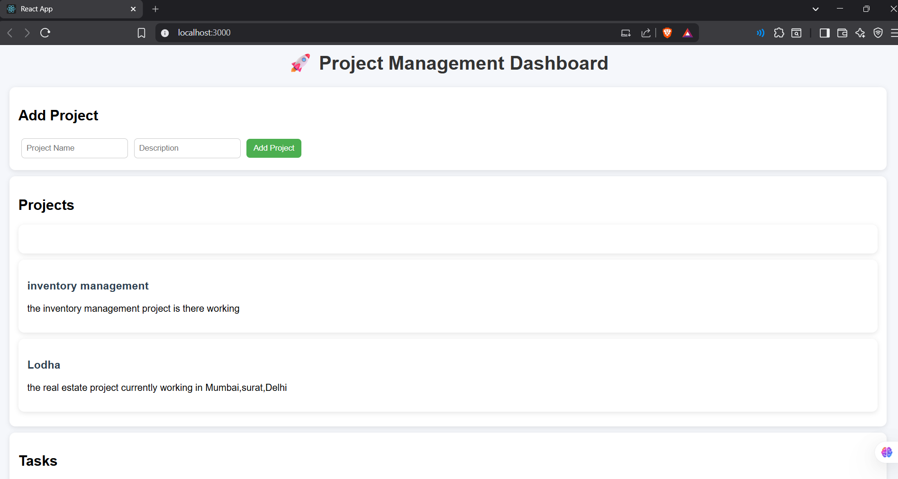
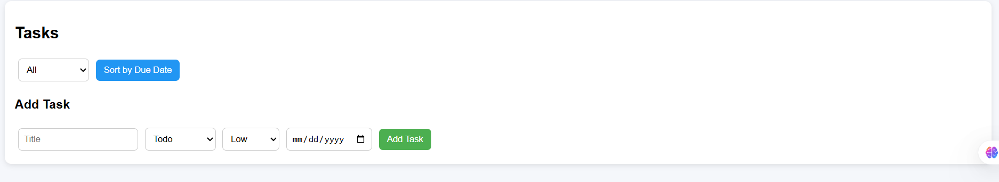

# 🚀 Mini Project Management System

A full-stack application to manage projects and tasks with filtering, sorting, and CRUD operations.

---

## 🛠️ Tech Stack

- Backend: Node.js, Express.js
- Frontend: React.js
- Database: MongoDB

---

## 📌 Features

### ✅ Projects
- Create Project
- View Projects
- Delete Project
- Pagination

### ✅ Tasks
- Add Task to Project
- View Tasks
- Update Task
- Delete Task
- Filter by Status (todo, in-progress, done)
- Sort by Due Date

---

## ⚙️ Backend Setup

```bash
cd backend
npm install
npm run dev

### Project List



### Task List
